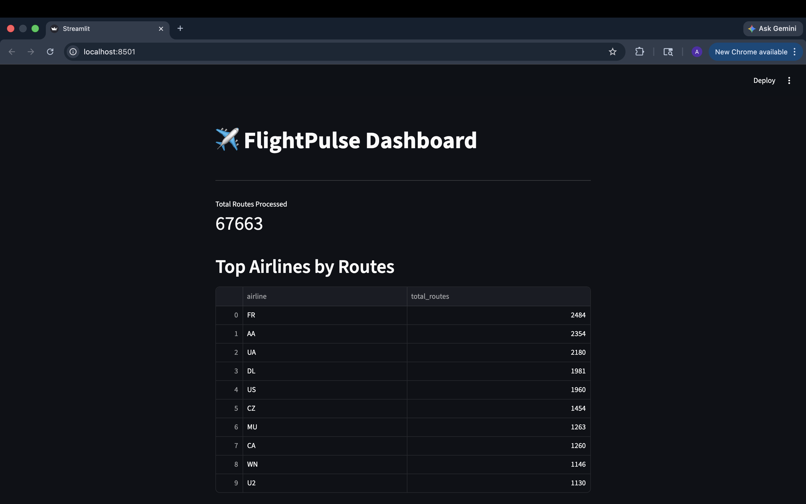
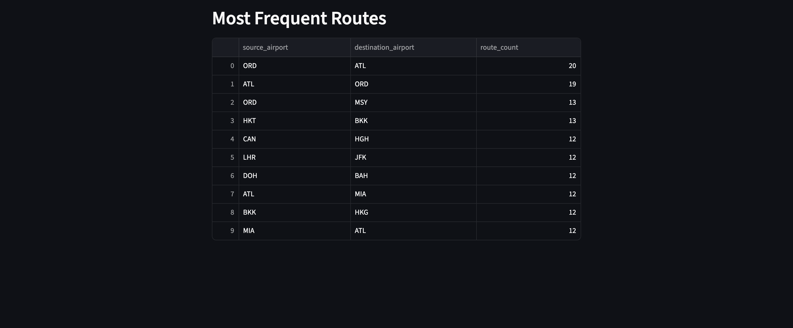
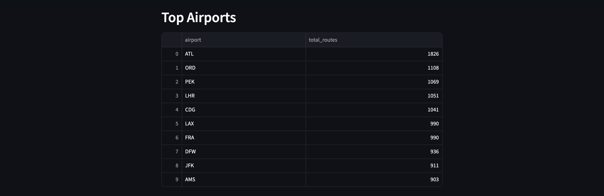

## FlightPulse [](https://github.com/ananyagullapally/flightpulse/actions/workflows/ci.yml) 


A batch ELT pipeline for flight delay analytics, built with Python, DuckDB, dbt, and GitHub Actions CI/CD.

---

### Overview

FlightPulse ingests raw flight data, loads it into a local DuckDB warehouse, transforms it with dbt, and surfaces delay insights through an analytics dashboard. It demonstrates a complete, production-style data engineering workflow — from raw source to curated mart — in a fully local, lightweight environment.

---

### Dashboard Preview

#### Overview


#### Top Airlines by Routes


#### Most Frequent Routes


#### Top Airports


---
### Architecture

```
Raw Data (CSV/API)
      │
      ▼
[ ingestion/ ]  ← Python scripts fetch & load data into DuckDB
      │
      ▼
[ DuckDB ]      ← Local analytical warehouse (flights.db)
      │
      ▼
[ flightpulse_dbt/ ]  ← dbt models: staging → intermediate → mart
      │
      ▼
[ dashboard/ ]  ← Analytics layer (queries on top of dbt marts)
```

---

### Tech Stack

| Layer | Tool |
|---|---|
| Ingestion | Python (`requests`, `pandas`) |
| Warehouse | DuckDB |
| Transformation | dbt-core |
| Testing | pytest + dbt tests |
| CI/CD | GitHub Actions |

---

### Project Structure

```
flightpulse/
├── .github/
│   └── workflows/        # CI/CD pipeline (lint, test, dbt run)
├── ingestion/            # Python scripts to fetch and load raw data
├── data/
│   └── raw/              # Raw source files (CSV)
├── flightpulse_dbt/      # dbt project
│   ├── models/
│   │   ├── staging/      # Clean, typed raw sources
│   │   ├── intermediate/ # Business logic joins
│   │   └── marts/        # Final analytics-ready tables
│   └── tests/            # dbt schema & data tests
├── dashboard/            # Dashboard queries / Streamlit app
├── tests/                # pytest unit tests for ingestion layer
└── pyproject.toml        # Project dependencies and config
```

---

### Getting Started

#### Prerequisites

- Python 3.11+
- pip

#### Installation

```bash
git clone https://github.com/ananyagullapally/flightpulse.git
cd flightpulse
python -m venv venv
source venv/bin/activate  # Windows: venv\Scripts\activate
pip install -e ".[dev]"
pip install dbt-duckdb
```

#### Run the Pipeline

```bash
# 1. Ingest raw data into DuckDB
python ingestion/ingest.py

# 2. Run dbt transformations
cd flightpulse_dbt
dbt run

# 3. Run dbt tests
dbt test
```

#### Run Unit Tests

```bash
pytest tests/
```

---

### Key Analytics

The dbt marts expose metrics such as:

- Average delay by airline and route
- On-time performance by airport and time of day
- Delay cause breakdown (carrier, weather, NAS, security, late aircraft)
- Month-over-month delay trends

---

### CI/CD

GitHub Actions runs on every push to `main`:
1. Install dependencies
2. Run `pytest` unit tests
3. Run `dbt run` and `dbt test` against a test DuckDB instance

---

### Data Source

Flight delay data sourced from the [Bureau of Transportation Statistics (BTS)](https://www.transtats.bts.gov/), which publishes monthly on-time performance records for US domestic flights.

